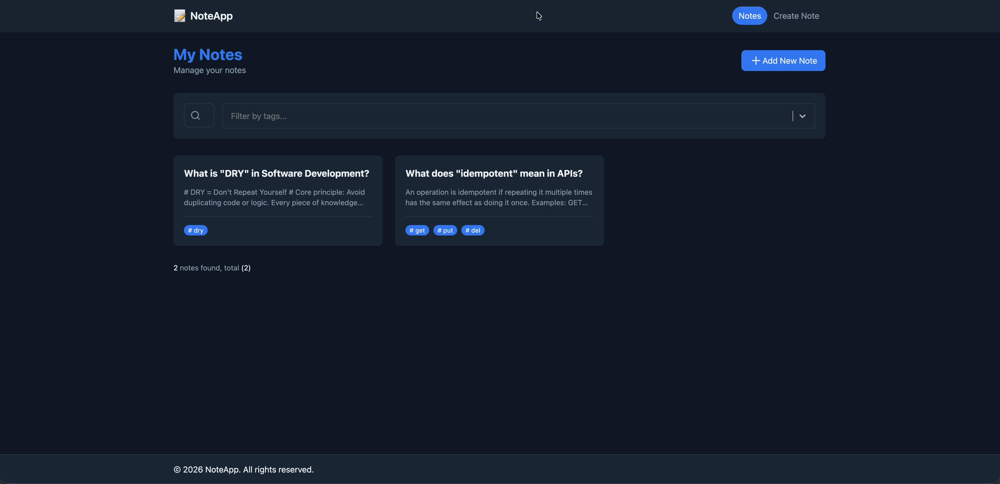

# Note App – Modern Note-Taking Application

A clean, modern note-taking app built with **React** + **TypeScript** + **Redux Toolkit**.  
Supports Markdown editing, tags, search/filtering, persistent storage, and full CRUD operations.

## 🖥️ Live Demo

🔗 **https://bck-noteapp-bck.netlify.app**

## Features

- Create new notes (title + Markdown content + tags)
- View all notes in a list with title-based search
- Filter notes by multiple tags (multi-select dropdown)
- View note details in a dedicated page
- Edit notes with live-preview Markdown editor
- Delete notes
- Automatically collect and show unique tags from all notes
- Persistent storage (notes remain after page refresh / browser close)
- Toast notifications for create/update/delete actions
- Responsive, clean and modern UI/UX

## 🧰 Technologies Used

- **React** — UI library
- **TypeScript** — Type safety
- **TailwindCSS** — Utility-first styling
- **React Router DOM** — Client-side routing
- **Redux Toolkit** — State management (@reduxjs/toolkit)
- **Redux Persist** — Persist state to localStorage
- **react-simplemde-editor** + **easymde** — Markdown editor with live preview
- **react-markdown** — Render Markdown content
- **react-select** — Advanced multi-select for tag filtering
- **uuid** — Generate unique note IDs
- **lucide-react** — Beautiful icon set
- **react-toastify** — Toast notifications

  # 📧 Contact

- kardesbahadircan@gmail.com
